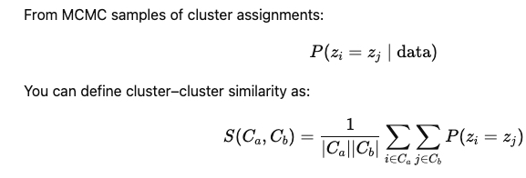

[](https://travis-ci.org/ReddyLab/DP_GP_cluster)

## DP_GP_cluster (proteomics fork)

DP_GP_cluster clusters features by abundance over a time course using a Dirichlet process Gaussian process model.

> **About this fork.** This repository is a **Python 3** port of the original
> [PrincetonUniversity/DP_GP_cluster](https://github.com/PrincetonUniversity/DP_GP_cluster)
> (Python 2), adapted here for **proteomics** time-course data rather than RNA-seq /
> microarray gene expression. The clustering model is unchanged — only the input
> domain, plot labels, and a cluster-distance utility are proteomics-specific.
>
> This fork implements the clustering methodology described in the paper
> *"Endocytic Turnover of Endothelial Cell-Membrane Proteins as a Driver of Rat
> Blood Brain Barrier Specialization and Dysfunction"* (ISCIENCE-D-25-18428R1).
>
> Throughout this README and the upstream code, references to "genes" /
> "gene expression" should be read as **proteins** / **protein abundance**. Plot
> y-axes are labeled `Protein abundance`.
>
> Two proteomics-fork additions on top of the upstream Python 3 port:
> - **Inter-cluster distance** — see the [Inter-cluster distance](#inter-cluster-distance) section.
> - **Long-running job monitoring** — optional logging and auto-restart wrappers for
>   multi-day runs, see [Long-running jobs and monitoring](#long-running-jobs-and-monitoring).
>   For short runs simply invoke `DP_GP_cluster.py` directly; monitoring is *not* required.

## Motivation

Genes that follow similar expression trajectories in response to stress or stimulus tend to share biological functions.  Thus, it is reasonable and common to cluster genes by expression trajectories.  Two important considerations in this problem are (1) selecting the "correct" or "optimal" number of clusters and (2) modeling the trajectory and time-dependency of gene expression. A [Dirichlet process](http://en.wikipedia.org/wiki/Dirichlet_process) can determine the number of clusters in a nonparametric manner, while a [Gaussian process](http://en.wikipedia.org/wiki/Gaussian_process) can model the trajectory and time-dependency of gene expression in a nonparametric manner.

## Installation and Dependencies
1. create and activate conda/mamba environment
```bash
mamba create -n DP_GP-env python=3.10
mamba activate DP_GP-env
```
2. Install Cython and numpy
```bash
mamba install -c conda-forge Cython numpy
```
3. Clone repo
```bash
git clone https://github.com/Molecular-Bionics-Labs/DP_GP_cluster_proteomics.git
```
4. Use pip for installation
```bash
cd path/to/DP_GP_cluster
pip install .
```

DP_GP_cluster requires the following automatically installed Python packages:
    
    GPy, pandas, numpy, scipy (>= 0.14), matplotlib.pyplot

It has been tested in linux with Python 3.10 and with Anaconda distributions of the latter four above packages.


## Tests

    cd DP_GP_cluster
    DP_GP_cluster.py -i test/test.txt -o test/test -p png -n 20 --plot

## Code Examples

To cluster genes by expression over time course and create gene-by-gene posterior similarity matrix:
    
    DP_GP_cluster.py -i /path/to/expression.txt -o /path/to/output_prefix [ optional args, e.g. -n 2000 --true_times --criterion MAP --plot ... ]
    
Above, `expression.txt` is of the format:

    gene    1     2    3    ...    time_t
    gene_1  10    20   5    ...    8
    gene_2  3     2    50   ...    8
    gene_3  18    100  10   ...    22
    ...
    gene_n  45    22   15   ...    60

where the first row is a header containing the time points and the first column is an index containing all gene names. Entries are delimited by tabs.

DP_GP_cluster can handle missing data so if an expression value for a given gene at a given time point leave blank or represent with "NA".

We recommend clustering only differentially expressed genes to save runtime. If genes can further be separated by up- and down-regulated beforehand, this will also substantially decrease runtime.

To cluster thousands of genes, use option `--fast`, although in this mode, no missing data allowed.

From the above command, the optimal clustering will be saved at `/path/to/output_path_prefix_optimal_clustering.txt` in a simple tab-delimited format:

    cluster	gene
    1	gene_1
    1	gene_23
    2	gene_7
    ...
    k	gene_30
    
Because the optimal clustering is chosen after the entirety of Gibbs sampling, the script can be rerun with alternative clustering optimality criteria to yield different sets of clusters. Also, if `--plot` flag was not indicated when the above script is called, plots can be generated after sampling:

    DP_GP_cluster.py \
    -i /path/to/expression.txt \
    --sim_mat /path/to/output_prefix_posterior_similarity_matrix.txt \
    --clusterings /path/to/output_prefix_clusterings.txt \
    --criterion MPEAR \
    --post_process \
    --plot --plot_types png,pdf \
    --output /path/to/output_prefix_MPEAR_optimal_clustering.txt \
    --output_path_prefix /path/to/output_prefix_MPEAR

When the `--plot` flag is indicated, the script plots (1) gene expression trajectories by cluster along with the Gaussian Process parameters of each cluster and (2) the posterior similarity matrix in the form of a heatmap with dendrogram. For example:

#### Gene expression trajectories by cluster*


*from McDowell et al. 2017, A549 dexamethasone exposure RNA-seq data

#### Posterior similarity matrix**


**from McDowell et al. 2017, _H. salinarum_ hydrogen peroxide exposure microarray data

For more details on particular parameters, see detailed help message in script.

### Using DP_GP functions without wrapper script

Users have the option of directly importing DP_GP for direct access to functions. For example,
    
    from DP_GP import core
    import GPy
    from DP_GP import cluster_tools
    import numpy as np
    from collections import defaultdict

    expression = "/path/to/expression.txt"
    optimal_clusters_out = "/path/to/optimal_clusters.txt"

    # read in gene expression matrix
    gene_expression_matrix, gene_names, t, t_labels = core.read_gene_expression_matrices([expression])

    # run Gibbs Sampler
    GS = core.gibbs_sampler(gene_expression_matrix, t, 
                            max_num_iterations=200, 
                            burnIn_phaseI=50, burnIn_phaseII=100)
    sim_mat, all_clusterings, sampled_clusterings, log_likelihoods, iter_num = GS.sampler()

    sampled_clusterings.columns = gene_names
    all_clusterings.columns = gene_names

    # select best clustering by maximum a posteriori estimate
    optimal_clusters = cluster_tools.best_clustering_by_log_likelihood(np.array(sampled_clusterings), 
                                                                       log_likelihoods)

    # combine gene_names and optimal_cluster info
    optimal_cluster_labels = defaultdict(list)
    optimal_cluster_labels_original_gene_names = defaultdict(list)
    for gene, (gene_name, cluster) in enumerate(zip(gene_names, optimal_clusters)):
        optimal_cluster_labels[cluster].append(gene)
        optimal_cluster_labels_original_gene_names[cluster].append(gene_name)

    # save optimal clusters
    cluster_tools.save_cluster_membership_information(optimal_cluster_labels_original_gene_names, 
                                                      optimal_clusters_out)

With this approach, the user will have access to the GP models parameterized to each cluster. With this, the user could, e.g., draw samples from a cluster GP or predict a new expression value at a new time point along with the associated uncertainty.

    # [continued from above]
    # optimize GP model for best clustering
    optimal_clusters_GP = {}
    for cluster, genes in optimal_cluster_labels.iteritems():
        optimal_clusters_GP[cluster] = core.dp_cluster(members=genes, 
                                                       X=np.vstack(t), 
                                                       Y=np.array(np.mat(gene_expression_matrix[genes,:])).T)
        optimal_clusters_GP[cluster] = optimal_clusters_GP[cluster].update_cluster_attributes(gene_expression_matrix)

    def draw_samples_from_cluster_GP(cluster_GP, n_samples=1):
        samples = np.random.multivariate_normal(cluster_GP.mean, cluster_GP.covK, n_samples)    
        return samples

    def predict_new_y_from_cluster_GP(cluster_GP, new_x):
        next_time_point = np.vstack([cluster_GP.t, new_x])
        mean, var = cluster_GP.model._raw_predict(next_time_point)
        y, y_var = float(mean[-1]), float(var[-1])
        return y, y_var

    draw_samples_from_cluster_GP(optimal_clusters_GP[1])
    predict_new_y_from_cluster_GP(optimal_clusters_GP[2], new_x=7.2)

    
## Inter-cluster distance

After Gibbs sampling produces an optimal clustering and a gene-by-gene posterior
similarity matrix `P(z_i = z_j)`, we summarize how close two clusters are by
averaging the pairwise posterior co-clustering probabilities of their members:



That is, for clusters `Cₐ` and `C_b`:

```
S(Cₐ, C_b) = (1 / |Cₐ||C_b|) · Σ_{i ∈ Cₐ, j ∈ C_b}  P(z_i = z_j)
D(Cₐ, C_b) = 1 − S(Cₐ, C_b)
```

The implementation is in [`cluster_dist/110_cluster_distances.py`](cluster_dist/110_cluster_distances.py).
It is vectorized with `numpy.ix_` and is intended for large similarity matrices
(tested on a 19 K × 19 K matrix). Outputs:

- `cluster_similarity_matrix.tsv` — `S(Cₐ, C_b)`
- `cluster_distance_matrix.tsv` — `D = 1 − S`
- `cluster_distance_heatmap.png`
- `cluster_dendrogram.png` (average-linkage hierarchy on `D`)

Adjust the `BASE` / input paths at the top of the script for your data, then:

```bash
python cluster_dist/110_cluster_distances.py
```

## Long-running jobs and monitoring

Gibbs sampling over thousands of features can take **days** to converge. To make
overnight / multi-day runs reliable, this repo ships an optional monitoring
layer in [`MONITORING.md`](MONITORING.md):

- **`run_dp_gp_monitored.sh`** — wrapper around `DP_GP_cluster.py` that adds
  timestamped logs, memory / disk tracking, signal handling, an 83-hour timeout
  guard, and optional email / Slack / GitHub-issue notifications on
  start / finish / crash.
- **`monitor_dp_gp.sh --auto-restart`** — external watchdog that detects a
  crashed run and restarts it (configurable max attempts), so a single OOM or
  transient error does not waste the whole run.
- **`setup_monitoring.sh`** — interactive first-time setup for the
  notification channels.

Typical multi-day workflow:

```bash
./setup_monitoring.sh                            # one-time
./monitor_dp_gp.sh --auto-restart --max-attempts=5 &
./run_dp_gp_monitored.sh
```

All logs land in `logs/` (`dp_gp_*.log`, `monitor_*.log`). See
[`MONITORING.md`](MONITORING.md) for the full feature list, notification config,
troubleshooting tips, and recovery commands.

The monitoring layer is **fully optional** — for short runs simply invoke
`DP_GP_cluster.py` directly.

## Citation

If you use this proteomics fork, please cite:

> *"Endocytic Turnover of Endothelial Cell-Membrane Proteins as a Driver of Rat
> Blood Brain Barrier Specialization and Dysfunction"* (ISCIENCE-D-25-18428R1).

Original DP_GP_cluster method:

I. C. McDowell, D. Manandhar, C. M. Vockley, A. Schmid, T. E. Reddy, B. Engelhardt, Clustering gene expression time series data using an infinite Gaussian process mixture model. _bioRxiv_  (2017).

I. C. McDowell, D. Manandhar, C. M. Vockley, A. Schmid, T. E. Reddy, B. Engelhardt, Clustering gene expression time series data using an infinite Gaussian process mixture model. _PLOS Computational Biology_ (In revision).

## License
[BSD 3-clause](https://github.com/PrincetonUniversity/DP_GP_cluster/blob/master/LICENSE)
    
